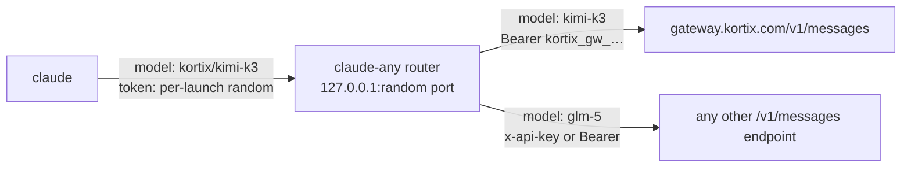

# claude-any

Run [Claude Code](https://code.claude.com) on any Anthropic-compatible model
endpoint, and switch between all of them from `/model`.

```text
$ claude-any
 ▐▛███▛█   Claude Code v2.1.283
▝▜██████▀  GPT-6 Sol (ChatGPT) with high effort

> /model
   1. Default (recommended)  Use the default model (currently kortix/kimi-k3[1m])
   2. Kimi K3 2.8T           kortix · 1M context · $2.5/$14 per MTok
   3. GLM 5.3 Flash          kortix · 1M context · $0.1/$0.35 per MTok
   4. DeepSeek V4.1 Flash    kortix · 1M context · $0.15/$0.6 per MTok
 ❯ 5. GPT-6 Sol (ChatGPT) ✔  kortix · 1.1M context · billed to ChatGPT plan
   6. GPT-6 Luna (ChatGPT)   kortix · 1.1M context · billed to ChatGPT plan
```

It uses the unmodified `claude` binary. Nothing is patched or reverse
engineered on the Claude Code side: it uses the documented gateway settings.

## Install

Requires [Bun](https://bun.sh) ≥ 1.1 and Claude Code ≥ 2.1.242.

```bash
bun add -g github:markokraemer/claude-any
```

or from a clone:

```bash
git clone https://github.com/markokraemer/claude-any ~/Projects/claude-any
ln -s ~/Projects/claude-any/bin/claude-any ~/.local/bin/claude-any
```

## Quick start

```bash
claude-any add kortix                      # prompts for the key; stored in the macOS Keychain
claude-any models kortix gpt               # search the provider's model list
claude-any enable kortix/kimi-k3 kortix/codex/gpt-6-sol
claude-any default kortix/kimi-k3          # the model a new session starts on
claude-any small kortix/glm-5.3-flash      # titles, summaries, "haiku" subagents, auto-mode classifier
claude-any doctor                          # one short request per provider
claude-any                                 # start Claude Code; any claude flag works
```

Any endpoint that serves the Anthropic Messages API works:

```bash
claude-any add mygw --base-url https://llm.example.com --auth bearer --key-env MYGW_KEY
```

## How it works



`claude-any` starts a local router, then starts `claude` with:

| Setting | Value | Why |
| --- | --- | --- |
| `ANTHROPIC_BASE_URL` | the router | Every request goes through it |
| `ANTHROPIC_AUTH_TOKEN` | a random token per launch | Other local processes cannot use the port; upstream keys stay in the router |
| `--settings` → `modelPicker` | one row per model, `replaceBuiltInOptions: true` | `/model` lists exactly your models, with labels, context size, and price |
| `ANTHROPIC_DEFAULT_{OPUS,SONNET,FABLE}_MODEL` | your default model | Subagents pinned to an alias stay on your providers |
| `ANTHROPIC_DEFAULT_HAIKU_MODEL` | your small model | Background requests and the auto-mode classifier |
| `CLAUDE_CODE_MAX_CONTEXT_TOKENS` | smallest known context window | Claude Code cannot set a window per model |
| `CLAUDE_CODE_AUTO_MODE_SERVER` | `0` unless every provider is Anthropic-native | See [Auto mode](#auto-mode) |

The router reads the `provider/` prefix of the model id, strips it, and sends
the request to that provider with its key. It does not translate formats.
Upstream errors pass through unchanged, because Claude Code's retries and
reactive compaction match on the upstream's wording.

### Compatibility fixes in the router

- **Missing usage.** When an upstream reports no input tokens, the router
  writes an estimate (request bytes ÷ 4) into `message_delta`. Without it
  Claude Code never auto-compacts. Turn off with `"estimateMissingUsage": false`.
- **`/model` persistence.** Claude Code saves a `/model` pick into
  `~/.claude/settings.json`. A plain `claude` cannot use a routed id, so the
  launcher restores that key on exit and keeps your pick in its own state. The
  next `claude-any` starts on it.
- **`[1m]` tags.** Claude Code may append a context tag to a model id. The
  router strips it.

## Auto mode

Auto mode's free server-side safety checks run on Anthropic's API and need the
request's `safeguards` field to reach Anthropic. A non-Anthropic upstream cannot
run them, so Claude Code would fall back mid-session and show *"this session
isn't eligible"*. `claude-any` sets `CLAUDE_CODE_AUTO_MODE_SERVER=0` when any
configured provider is not Anthropic-native: Claude Code then runs its own
classifier from the start, through the router, on your small model. `/status`
shows **Auto mode server: Disabled**. Set the variable yourself to override.

## ChatGPT models through the Kortix gateway

The Kortix gateway serves `codex/*` models on a ChatGPT subscription connected
to the project. With a project gateway key, the project needs a ChatGPT
connection shared with **Everyone in this project**. The picker marks these
rows *billed to ChatGPT plan*.

## Commands

```text
claude-any [claude args…]            Start Claude Code through the router
claude-any add <name> [options]      Add a provider (--base-url, --auth, --key | --key-env, --forward-betas)
claude-any key <name>                Replace a provider's key
claude-any models <name> [search]    List the provider's models (* = in the picker)
claude-any enable <provider/model>…  Add models to the picker
claude-any disable <provider/model>… Remove models from the picker
claude-any default <provider/model>  Model a new session starts on
claude-any small <provider/model>    Model for background requests
claude-any list                      Show providers and picker models
claude-any doctor                    Send one short request to every provider
claude-any router [--port N]         Run only the router; prints the env for a plain `claude`
claude-any remove <name>             Remove a provider and its key
claude-any --version
```

Pass `--` to hand an argument that looks like a subcommand to `claude`.

## Presets

| Preset | Base URL | Auth | Verified |
| --- | --- | --- | --- |
| `kortix` | `https://gateway.kortix.com` | Bearer | yes |
| `anthropic` | `https://api.anthropic.com` | `x-api-key`, betas forwarded | no |
| `openrouter` | `https://openrouter.ai/api` | Bearer | no |
| `deepseek` | `https://api.deepseek.com/anthropic` | Bearer | no |
| `moonshot` | `https://api.moonshot.ai/anthropic` | Bearer | no |
| `zai` | `https://api.z.ai/api/anthropic` | Bearer | no |
| `minimax` | `https://api.minimax.io/anthropic` | Bearer | no |

Run `claude-any doctor` after adding an unverified preset.

## Files

| Path | Content |
| --- | --- |
| `~/.config/claude-any/config.json` | Providers, models, defaults (mode 0600). Keys live in the Keychain, or here on non-macOS systems |
| `~/.config/claude-any/state.json` | Last model picked in `/model` |
| `~/.config/claude-any/cache/` | Model lists for picker labels |
| `~/.config/claude-any/router.log` | One line per request: model, provider, status, latency. No bodies |

`CLAUDE_ANY_HOME` moves the directory. `CLAUDE_ANY_CLAUDE_BIN` picks another
`claude` binary.

## Limits

- One context window for all models (see above). Set `"maxContextTokens"` in
  the config to override.
- The picker's **Default** row shows the raw id with a `[1m]` tag.
- Claude Code prints `[claude-code:unrecognized_model]` on stderr in `-p` mode
  for non-Claude ids. It does not affect the run.
- Claude Code disables claude.ai connectors while another auth source is set.
- Upstreams that do not speak Anthropic Messages (plain OpenAI APIs) need a
  translating gateway in front, such as the Kortix gateway or LiteLLM.

## Other projects

| Project | Approach | Difference |
| --- | --- | --- |
| [musistudio/claude-code-router](https://github.com/musistudio/claude-code-router) | Local proxy that translates Anthropic ↔ OpenAI-style providers; routing rules | Translates formats; claude-any passes Anthropic traffic through and uses Claude Code's native `/model` picker |
| [coder/anyclaude](https://github.com/coder/anyclaude) | AI SDK proxy for OpenAI, Google, xAI | Translates formats |
| [router-for-me/CLIProxyAPI](https://github.com/router-for-me/CLIProxyAPI) | Serves OAuth subscriptions behind OpenAI/Claude-compatible APIs | Subscription bridging; the providers' policy on third-party use of those logins is unresolved |
| [LiteLLM](https://docs.litellm.ai) | General gateway with an Anthropic `/v1/messages` endpoint | A server to run; pair it with claude-any for the picker |

## Development

```bash
bun install
bun test              # unit tests: router, config, picker, settings restore
bun run typecheck
```

End-to-end tests run the real `claude` binary against a live provider and check
real outputs (files written, commands run, token usage, stderr):

```bash
CLAUDE_ANY_HOME=~/.config/claude-any bun test/e2e/e2e.ts kortix/glm-5.3-flash --deep kortix/kimi-k3
```

Every model runs a Write + Bash tool task. `--deep` models also run auto mode,
an image returned by `Read`, an `Explore` subagent, `--continue`, and
`/compact`.

## License

MIT
