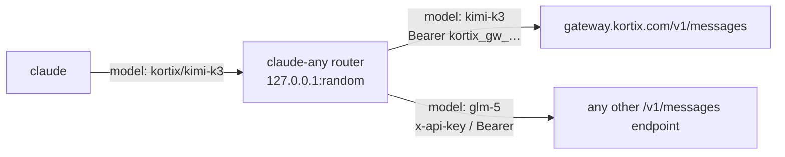

# claude-any

Run Claude Code on any Anthropic-compatible model endpoint, and pick every
model from `/model`.

```text
$ claude-any
 ▐▛███▜▌   Claude Code v2.1.283
▝▜█████▛▘  Kimi K3 2.8T with high effort · API Usage Billing

> /model
   1. Default (recommended)  Use the default model (currently kortix/kimi-k3[1m])
 ❯ 2. Kimi K3 2.8T ✔         kortix · 1M context · $2.5/$14 per MTok
   3. GLM 5.3 Flash          kortix · 1M context · $0.1/$0.35 per MTok
   4. DeepSeek V4.1 Flash    kortix · 1M context · $0.15/$0.6 per MTok
```

## How it works



`claude-any` starts a local router, then starts the unmodified `claude` binary
with:

- `ANTHROPIC_BASE_URL` set to the router, and a per-launch random token as
  `ANTHROPIC_AUTH_TOKEN`. Upstream keys stay in the router process.
- a `--settings` file with a `modelPicker` lineup: one row per configured
  model, with `replaceBuiltInOptions: true`, so `/model` lists only your
  models.
- `ANTHROPIC_DEFAULT_{OPUS,SONNET,FABLE}_MODEL` set to your default model and
  `ANTHROPIC_DEFAULT_HAIKU_MODEL` set to your small model. Subagents pinned to
  an alias and Claude Code's background requests stay on your providers.
- `CLAUDE_CODE_MAX_CONTEXT_TOKENS` set to the smallest known context window of
  your models. Claude Code cannot set this per model.

The router reads the `provider/` prefix of the model id, strips it, and sends
the request to that provider with its key. It does not translate formats: every
upstream must speak the Anthropic Messages API. Errors pass through unchanged,
because Claude Code's retries and reactive compaction match on their wording.

Two compatibility fixes:

- **Missing usage.** When an upstream reports no input tokens, the router
  writes an estimate (request bytes ÷ 4) into `message_delta`. Without it
  Claude Code never auto-compacts. Turn off with `"estimateMissingUsage": false`.
- **`/model` persistence.** Claude Code saves a `/model` pick into
  `~/.claude/settings.json`. A plain `claude` cannot use a routed id, so the
  launcher restores that key on exit and keeps your pick in its own state. The
  next `claude-any` starts on it.

## Install

Requires [Bun](https://bun.sh) and Claude Code.

```bash
git clone <this repo> ~/Projects/claude-any
ln -s ~/Projects/claude-any/bin/claude-any ~/.local/bin/claude-any
```

## Use

```bash
claude-any add kortix                     # prompts for the key, stores it in the macOS Keychain
claude-any models kortix flash            # search the provider's model list
claude-any enable kortix/kimi-k3 kortix/glm-5.3-flash
claude-any default kortix/kimi-k3
claude-any small kortix/glm-5.3-flash     # titles, summaries, "haiku" subagents
claude-any doctor                         # one short request per provider
claude-any                                # start Claude Code; any claude flags work
claude-any -p "fix the failing test" --allowedTools Bash,Edit
```

Any Anthropic-compatible endpoint works:

```bash
claude-any add mygw --base-url https://llm.example.com --auth bearer --key-env MYGW_KEY
```

Presets (`claude-any add <name>`):

| Preset | Base URL | Verified |
| --- | --- | --- |
| `kortix` | `https://gateway.kortix.com` | yes, 2026-09-26 |
| `anthropic` | `https://api.anthropic.com` | no |
| `openrouter` | `https://openrouter.ai/api` | no |
| `deepseek` | `https://api.deepseek.com/anthropic` | no |
| `moonshot` | `https://api.moonshot.ai/anthropic` | no |
| `zai` | `https://api.z.ai/api/anthropic` | no |
| `minimax` | `https://api.minimax.io/anthropic` | no |

Run `claude-any doctor` after adding an unverified preset.

`claude-any router` runs only the router and prints the two variables for a
plain `claude` in another shell.

Files: `~/.config/claude-any/config.json` (0600), `state.json`, `cache/`,
`router.log` (one line per request: model, provider, status, latency; no
bodies). `CLAUDE_ANY_HOME` moves the directory.

## Limits

- One context window for all models (see above). Set `"maxContextTokens"` in
  the config to override.
- Claude Code prints `[claude-code:unrecognized_model]` on stderr in `-p` mode
  for non-Claude ids. It does not affect the run.
- Claude Code disables claude.ai connectors while another auth source is set.
- The picker's **Default** row shows the raw id with a `[1m]` tag. Claude Code
  strips the tag before sending; the router strips it too.
- Upstreams that do not speak Anthropic Messages (plain OpenAI APIs) need a
  translating gateway in front, such as the Kortix gateway or LiteLLM.

## Other projects

| Project | Approach | Difference |
| --- | --- | --- |
| [musistudio/claude-code-router](https://github.com/musistudio/claude-code-router) | Local proxy that translates Anthropic ↔ OpenAI-style providers, routing rules, `/model provider,model` switching | Translates formats; claude-any passes Anthropic traffic through and uses Claude Code's native `/model` picker |
| [coder/anyclaude](https://github.com/coder/anyclaude) | Wraps Claude Code with an AI-SDK proxy for OpenAI, Google, xAI | Translates formats |
| [router-for-me/CLIProxyAPI](https://github.com/router-for-me/CLIProxyAPI) | Serves OAuth subscriptions (Codex, Gemini, …) behind OpenAI/Claude-compatible APIs | Subscription bridging; policy on third-party use of those logins is unresolved |
| [raine/claude-code-proxy](https://github.com/raine/claude-code-proxy) | Local proxy for Claude Code against ChatGPT, Kimi, Grok subscriptions | Subscription bridging, same caveat |
| [LiteLLM](https://docs.litellm.ai) | General gateway with an Anthropic `/v1/messages` endpoint | A server to run and configure; pair it with claude-any for the picker |

## Development

```bash
bun install
bun test          # router, config, picker, settings restore
bun run typecheck
```

MIT license.
