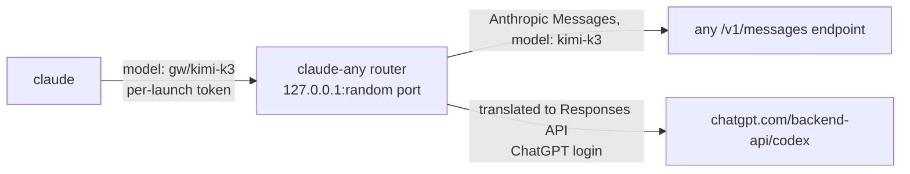

# claude-any

Run [Claude Code](https://code.claude.com) on any model behind an
Anthropic Messages API endpoint, or on GPT models from your ChatGPT plan, and
switch between all of them from `/model`.

```text
$ claude-any
 ▐▛███▛█   Claude Code v2.1.283
▝▜██████▀  GPT-6-Sol with high effort

> /model
   1. Default (recommended)  Use the default model (currently chatgpt/gpt-6-sol[1m])
   2. Kimi K3 2.8T           gw · 1M context · $2.5/$14 per MTok
   3. GLM 5.3 Flash          gw · 1M context · $0.1/$0.35 per MTok
 ❯ 4. GPT-6-Sol ✔            chatgpt · 272K context · billed to ChatGPT plan
   5. GPT-6-Luna             chatgpt · 272K context · billed to ChatGPT plan
```

It runs the unmodified `claude` binary and uses only Claude Code's documented
gateway settings.

## Requirements

- [Bun](https://bun.sh) ≥ 1.1 and Claude Code ≥ 2.1.242.
- One or both provider types:
  - **An Anthropic Messages API endpoint.** Anything that serves
    `POST {base-url}/v1/messages` in Anthropic's request, response, and
    streaming format: Anthropic's API, an LLM gateway, LiteLLM, a provider's
    Anthropic-compatible endpoint. claude-any does not translate formats for
    these; an OpenAI-only API needs a translating gateway in front.
  - **A ChatGPT plan with `codex login`.** The built-in `codex` provider reads
    `~/.codex/auth.json` and translates locally. See
    [ChatGPT models](#chatgpt-models-local-codex-provider).

## Install

```bash
bun add -g github:markokraemer/claude-any
```

or from a clone:

```bash
git clone https://github.com/markokraemer/claude-any ~/Projects/claude-any
ln -s ~/Projects/claude-any/bin/claude-any ~/.local/bin/claude-any
```

## Quick start

```bash
# Any Anthropic Messages API endpoint (the router calls <base-url>/v1/messages)
claude-any add gw --base-url https://llm.example.com --auth bearer   # prompts for the key → macOS Keychain
claude-any models gw kimi                  # search the endpoint's model list
claude-any enable gw/kimi-k3

# GPT models on your ChatGPT plan
codex login                                # once, with the Codex CLI
claude-any add chatgpt --codex
claude-any enable chatgpt/gpt-6-sol chatgpt/gpt-6-luna

claude-any default chatgpt/gpt-6-sol       # the model a new session starts on
claude-any small chatgpt/gpt-6-luna        # titles, summaries, "haiku" subagents, auto-mode classifier
claude-any doctor                          # one short request per provider
claude-any                                 # start Claude Code; any claude flag works
```

## How it works



`claude-any` starts a local router, then starts `claude` with:

| Setting | Value | Why |
| --- | --- | --- |
| `ANTHROPIC_BASE_URL` | the router | Every request goes through it |
| `ANTHROPIC_AUTH_TOKEN` | a random token per launch | Other local processes cannot use the port; credentials stay in the router |
| `--settings` → `modelPicker` | one row per model, `replaceBuiltInOptions: true` | `/model` lists exactly your models, with labels, context size, and price |
| `ANTHROPIC_DEFAULT_{OPUS,SONNET,FABLE}_MODEL` | your default model | Subagents pinned to an alias stay on your providers |
| `ANTHROPIC_DEFAULT_HAIKU_MODEL` | your small model | Background requests and the auto-mode classifier |
| `CLAUDE_CODE_MAX_CONTEXT_TOKENS` | smallest known context window | Claude Code cannot set a window per model |
| `CLAUDE_CODE_AUTO_MODE_SERVER` | `0` unless every provider is Anthropic's own API | See [Auto mode](#auto-mode) |

The router reads the `provider/` prefix of the model id, strips it, and hands
the request to that provider. One session can switch between providers in
`/model`; the conversation carries over.

### Anthropic Messages API endpoints

Requests and responses pass through. The router changes only:

- the model id and the auth header (`Authorization: Bearer` or `x-api-key`);
- for an endpoint that is not Anthropic's own API: it drops `metadata` and the
  `anthropic-beta` header, which some compatible endpoints reject. Mark an
  endpoint as Anthropic's own with `--native` (automatic for
  `api.anthropic.com`).

Upstream errors pass through unchanged, because Claude Code's retries and
reactive compaction match on the upstream's wording.

### ChatGPT models (local Codex provider)

`claude-any add <name> --codex` uses the ChatGPT login that `codex login`
stores in `~/.codex/auth.json` (`$CODEX_HOME` moves it) and talks to
`https://chatgpt.com/backend-api/codex` directly. The router translates each
request:

| Claude Code (Anthropic Messages) | ChatGPT backend (Responses API) |
| --- | --- |
| `system` | `instructions` |
| `tools`, `tool_choice` | function tools |
| `tool_use` / `tool_result` blocks | `function_call` / `function_call_output` items |
| images, including images a tool returns | `input_image` parts |
| `output_config.effort`, `thinking` | `reasoning.effort` (low … max, ultra) |
| `thinking` blocks with a signature | encrypted `reasoning` items, replayed on the next turn |
| streaming events, usage, `stop_reason` | from `response.*` events, cached tokens split out |
| session id | `prompt_cache_key` |

Every request sets `store: false`, as the Codex CLI does; the backend rejects
requests without it. Tokens refresh through `auth.openai.com`
and are written back to `auth.json` in the Codex CLI's format, so `codex`
keeps working. Token counting (`/v1/messages/count_tokens`) is not available;
Claude Code falls back to its own estimate.

> **Terms.** OpenAI has not published a position on third-party clients that
> use a ChatGPT login ([openai/codex#8338](https://github.com/openai/codex/discussions/8338)).
> Using this provider is your decision, on your own plan.

### Compatibility fixes

- **Missing usage.** When an upstream reports no input tokens, the router
  writes an estimate (request bytes ÷ 4) into `message_delta`. Without it
  Claude Code never auto-compacts. Turn off with `"estimateMissingUsage": false`.
- **`/model` persistence.** Claude Code saves a `/model` pick into
  `~/.claude/settings.json`. A plain `claude` cannot use a routed id, so the
  launcher restores that key on exit and keeps your pick in its own state. The
  next `claude-any` starts on it.
- **`[1m]` tags.** Claude Code may append a context tag to a model id. The
  router strips it.

## Auto mode

Auto mode's free server-side safety checks run on Anthropic's API and need the
request's `safeguards` field to reach Anthropic. Any other upstream cannot run
them, so Claude Code would fall back mid-session and show *"this session isn't
eligible"*. `claude-any` sets `CLAUDE_CODE_AUTO_MODE_SERVER=0` unless every
provider is Anthropic's own API: Claude Code then runs its own classifier from
the start, through the router, on your small model. `/status` shows
**Auto mode server: Disabled**. Set the variable yourself to override.

## Commands

```text
claude-any [claude args…]            Start Claude Code through the router
claude-any add <name> --base-url <url> [--auth bearer|x-api-key] [--key K | --key-env VAR] [--native]
claude-any add <name> --codex        GPT models on your ChatGPT plan, from `codex login`
claude-any key <name>                Replace a provider's key
claude-any models <name> [search]    List the provider's models (* = in the picker)
claude-any enable <provider/model>…  Add models to the picker
claude-any disable <provider/model>… Remove models from the picker
claude-any default <provider/model>  Model a new session starts on
claude-any small <provider/model>    Model for background requests
claude-any list                      Show providers and picker models
claude-any doctor                    Send one short request to every provider
claude-any router [--port N]         Run only the router; prints the env for a plain `claude`
claude-any remove <name>             Remove a provider and its key
claude-any --version
```

Pass `--` to hand an argument that looks like a subcommand to `claude`.

## Files

| Path | Content |
| --- | --- |
| `~/.config/claude-any/config.json` | Providers, models, defaults (mode 0600). Keys live in the macOS Keychain, or here on other systems |
| `~/.config/claude-any/state.json` | Last model picked in `/model` |
| `~/.config/claude-any/cache/` | Model lists for picker labels |
| `~/.config/claude-any/router.log` | One line per request: model, provider, status, latency. No bodies |

`CLAUDE_ANY_HOME` moves the directory. `CLAUDE_ANY_CLAUDE_BIN` picks another
`claude` binary.

## Limits

- One context window for all models (see above). Set `"maxContextTokens"` in
  the config to override.
- The picker's **Default** row shows the raw id with a `[1m]` tag.
- Claude Code prints `[claude-code:unrecognized_model]` on stderr in `-p` mode
  for non-Claude ids. It does not affect the run.
- Claude Code disables claude.ai connectors while another auth source is set.

## Other projects

| Project | Approach | Difference |
| --- | --- | --- |
| [musistudio/claude-code-router](https://github.com/musistudio/claude-code-router) | Local proxy that translates Anthropic ↔ OpenAI-style providers; routing rules | claude-any passes Anthropic endpoints through untouched and uses Claude Code's native `/model` picker |
| [coder/anyclaude](https://github.com/coder/anyclaude) | AI SDK proxy for OpenAI, Google, xAI API keys | Translates API-key providers; no ChatGPT login |
| [router-for-me/CLIProxyAPI](https://github.com/router-for-me/CLIProxyAPI) | Serves OAuth subscriptions behind OpenAI/Claude-compatible APIs | A separate server; claude-any runs in-process per session |
| [LiteLLM](https://docs.litellm.ai) | General gateway with an Anthropic `/v1/messages` endpoint | A server to run; pair it with claude-any for the picker |

## Development

```bash
bun install
bun test              # router, providers, Codex translation and login, config, picker
bun run typecheck
```

End-to-end tests run the real `claude` binary against live providers and check
real outputs (files written, commands run, token usage, stderr):

```bash
CLAUDE_ANY_HOME=~/.config/claude-any bun test/e2e/e2e.ts gw/glm-5.3-flash --deep chatgpt/gpt-6-sol
```

Every model runs a Write + Bash tool task. `--deep` models also run auto mode,
an image returned by `Read`, an `Explore` subagent, `--continue`, and
`/compact`.

## License

MIT
